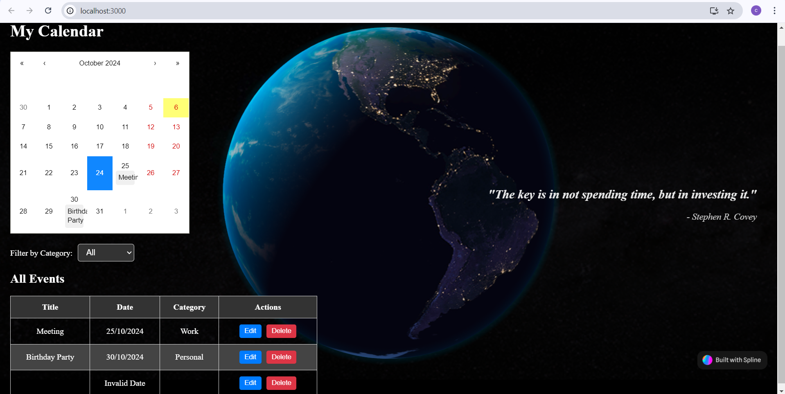

# React Calendar App with 3D Background and Event Management

This is a React-based calendar application that allows users to add, edit, delete, and filter events. The app features a 3D background created using **Spline** and a responsive event list. Events can be categorized, and a modal form is used to add and edit event details. 

## Table of Contents

- [Features](#features)
- [Demo](#demo)
- [Technologies Used](#technologies-used)
- [Installation](#installation)
- [Usage](#usage)
- [File Structure](#file-structure)
- [Available Scripts](#available-scripts)
- [Future Enhancements](#future-enhancements)
- [License](#license)

---

## Features

- **Event Management**: Users can add, edit, and delete events.
- **Category Filtering**: Events can be filtered by categories (e.g., Work, Personal, etc.).
- **Interactive Calendar**: Clickable dates to trigger event forms.
- **3D Background**: An interactive 3D Earth model rendered using Spline.
- **Responsive Design**: Fully responsive layout with scrollable event lists.
- **Modal Forms**: Modal-based input forms for events.
- **Accessible**: Modal is configured for screen reader accessibility.

---

## Demo

You can explore the app by following these steps after setting it up locally.



---

## Technologies Used

- **React**: For building the UI.
- **React Calendar**: For calendar date selection.
- **React Modal**: For handling modal-based forms.
- **React Context API**: For state management of events.
- **Spline**: For creating and embedding a 3D interactive background.
- **Axios**: For handling API requests (optional if API integration is added).
- **CSS/SCSS**: For styling the UI, including custom animations and layouts.

---

## Installation

To get started, clone the repository and install the dependencies.

### Prerequisites

Make sure you have the following installed:
- **Node.js** (>= 14.x.x)
- **npm** (>= 6.x.x) or **yarn**

### Steps

1. Clone the repository:
    ```bash
    git clone https://github.com/your-username/react-calendar-app.git
    cd react-calendar-app
    ```

2. Install dependencies:
    ```bash
    npm install
    ```

3. Run the application:
    ```bash
    npm start
    ```

4. Open your browser and navigate to:
    ```
    http://localhost:3000
    ```


## Usage

Once you start the app, you can:

1. **Add Events**: Click on any date in the calendar. A modal will appear allowing you to add event details such as title, description, and category.
2. **Edit Events**: Click the "Edit" button next to an existing event to modify its details.
3. **Delete Events**: Click the "Delete" button next to an event to remove it from the list.
4. **Filter Events**: Use the category dropdown to filter events based on their categories (Work, Personal, Other, etc.).
5. **Interactive 3D Background**: The 3D Earth in the background is interactive and adjusts based on user input.

---

## File Structure

Here's an overview of the file structure:

```bash
├── public/
│   └── index.html      # Main HTML file
├── src/
│   ├── components/
│   │   ├── Calendar.js   # React Calendar component
│   │   ├── EventForm.js  # Event Form component for adding/editing events
│   │   ├── EventModal.js # Modal component for event form
│   ├── context/
│   │   └── EventsContext.js # Context API for managing events globally
│   ├── pages/
│   │   ├── CalendarPage.js  # Main calendar page
│   ├── App.js               # Main App component
│   ├── index.js             # Entry point for React
│   └── CalendarPage.css     # CSS for CalendarPage styling
└── package.json             # Project configuration and dependencies
